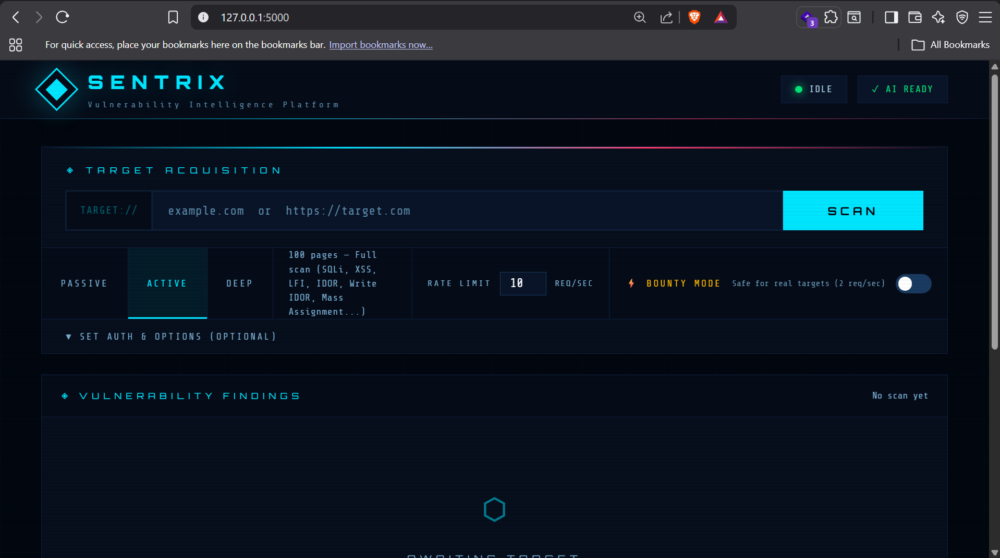
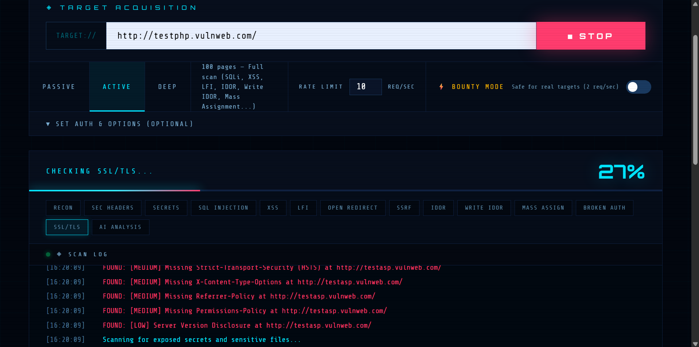
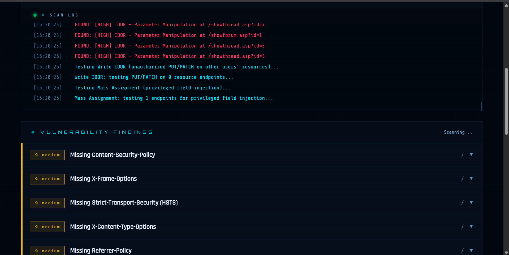

# SENTRIX — Web Application Vulnerability Scanner

SENTRIX is a Python/Flask-based web application vulnerability scanner built to learn and practice real-world web application penetration testing techniques. It combines a multi-module active scanning engine with a live browser dashboard and optional AI-assisted reporting.

> ⚠️ **For authorized testing only.** Only scan targets you own or have explicit written permission to test. SENTRIX includes built-in scope-locking to help prevent accidental out-of-scope requests, but you are responsible for how you use it.



---

## Features

**Scan Modules**
- SQL Injection
- Cross-Site Scripting (XSS) — including context-aware payload selection
- Server-Side Template Injection (SSTI)
- Command Injection
- Local File Inclusion (LFI)
- Server-Side Request Forgery (SSRF)
- Open Redirect
- Insecure Direct Object Reference (IDOR) — read and write variants
- Mass Assignment
- Broken Authentication checks
- JWT inspection
- GraphQL testing
- CORS misconfiguration checks
- Security header analysis
- SSL/TLS configuration checks
- Hidden parameter discovery
- Exposed secrets/credentials detection

**Engine**
- Multi-threaded crawler with configurable page limits (Passive / Active / Deep modes)
- Configurable rate limiting (requests/sec), including a "Bounty Mode" preset safe for live/real targets
- Scope locking — automatically blocks requests outside the target domain
- Live scan log and progress streaming to the dashboard
- Optional login/auth support (credentials or direct JWT/session token) for authenticated scans

**Reporting**
- Risk scoring and severity breakdown (Critical / High / Medium / Low)
- Attack path visualization
- Optional AI-generated analysis and remediation report (via Groq API — free tier available)
- Exportable text report

---

## Tech Stack

| Layer      | Technology |
|------------|------------|
| Backend    | Python, Flask, Flask-CORS |
| Frontend   | HTML, CSS, vanilla JavaScript |
| HTTP/Parsing | Requests, BeautifulSoup4 |
| AI Reporting (optional) | Groq API |

---

## Getting Started

### Prerequisites
- Python 3.9+
- pip

### Installation

```bash
git clone https://github.com/NamdevShivansh/SENTRIX.git
cd SENTRIX
pip install -r requirements.txt
```

### Configuration (optional — for AI report generation)

```bash
cp .env.example .env
```

Add your free [Groq API key](https://console.groq.com/keys) to `.env`. This step is **optional** — SENTRIX runs full scans without it; only the AI-generated report feature requires a key.

### Run

```bash
python backend.py
```

Then open your browser to:

```
http://127.0.0.1:5000
```

---

## Usage

1. Enter a target URL (domain or full URL).
2. Choose a scan mode:
   - **Passive** — non-intrusive checks only
   - **Active** — full vulnerability scan (default)
   - **Deep** — extended crawl depth and payload set
3. (Optional) Expand **Set Auth & Options** to scan authenticated areas — provide login credentials or paste a session/JWT token directly.
4. Adjust the rate limit, or enable **Bounty Mode** for a conservative 2 req/sec preset suited to live bug bounty targets.
5. Click **Scan** and watch live progress, findings, and risk scoring populate in real time.
6. Once complete, click **Generate AI Report** for a prioritized remediation summary (requires a Groq API key), or export findings as a text report.





---

## Project Structure

```
SENTRIX/
├── backend.py          # Flask backend — scanning engine, all vulnerability modules, API routes
├── index.html           # Dashboard UI
├── app.js               # Frontend logic — scan control, live updates, report rendering
├── style.css             # Dashboard styling
├── requirements.txt      # Python dependencies
├── .env.example           # Template for required environment variables
├── screenshots/            # README images
└── .gitignore
```

---

## Security & Ethics

SENTRIX was built as a personal learning project to understand how automated web application security scanners work under the hood — from crawling and payload injection to authenticated testing and reporting.

It is intended strictly for:
- Applications you own
- Targets where you have explicit written authorization to test (e.g. bug bounty programs, CTF/training targets)

The built-in scope-locking helps prevent out-of-scope requests, but responsible, authorized use is entirely the operator's responsibility. Do not use this tool against systems you do not have permission to test.

---

## License

Distributed under the MIT License. See [LICENSE](LICENSE) for details.